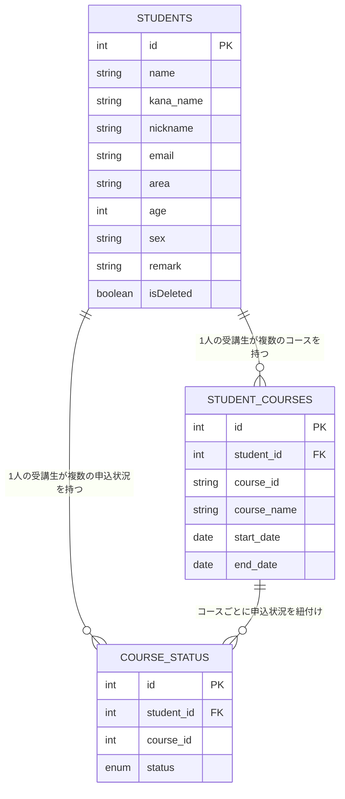

# Student Management System（受講生管理システム）  
 

## サービス概要

---

本アプリケーションは、**プログラミングスクールにおける受講生の情報を管理するためのシステム**です。  
受講生の基本情報、コース情報、申込状況を統合的に管理し、REST API経由で操作できます。  
受講生に関する情報の検索・登録・編集・削除を行い、学習進捗や受講コースを容易に把握することが可能です。  
**Spring Boot + MyBatis + MySQL** を使用し、MVCアーキテクチャの理解と実践を目的に開発しました。

## 作成背景

---

Javaを学習する過程で、**Spring Boot・MyBatis・REST API構成**の全体像を理解しながら、  
業務レベルの実装を習得することを目的に作成しました。

単なる動作確認に留まらず、以下のような観点で構成を意識しました。

- **Controller → Service → Repository → DB** の流れを明確に理解する  
- **MyBatis + XML Mapper** による SQL 制御を実務に近い形で体験する  
- **単体テスト（JUnit / Mockito）** による品質保証を組み込む  
- **AWS EC2** を用いたクラウド環境でのデプロイ体験  
- **Swagger UI** による API ドキュメント自動生成  

これらを通じて、**開発者・利用者の双方にとって理解しやすい設計**を心がけています。

## 主な使用技術

---

| 分類 | 技術 |
|------|------|
| 言語         | Java 21                                      |
| フレームワーク    | Spring Boot 3.5.3                         |
| DB         | MySQL（本番） / H2 Database（テスト）             |
| O/Rマッパー    | MyBatis 3.0.4                                |
| API仕様書     | Springdoc OpenAPI (Swagger UI)               |
| テスト        | JUnit 5 / AssertJ / Mockito                  |
| ビルド管理      | Gradle                                       |
| Lombok     | Getter/Setter・コンストラクタ自動生成                    |
| バリデーション    | Jakarta Validation（`@NotBlank`, `@Email` など） |

## 機能一覧

---

| 機能分類   | 内容 | 対応メソッド |
|-----------|------|---------------|
| 受講生詳細の一覧表示　 | 受講生詳細の全件検索（条件なし） | `GET /studentList` |
| 受講生詳細の特定表示　 | 受講生ID指定による受講生詳細の単一検索 | `GET /student/{id}` |
| 条件検索　 | 氏名・地域・年齢・性別・コース名などを任意に複数指定して受講生詳細を検索 | `POST /studentList/criteria` |
| 新規登録　 | 受講生 + コース情報 + 申込状況を一括で新規に登録 | `POST /registerStudent` |
| 更新処理　 | 受講生 + コース情報 + 申込状況を更新・論理削除（isDeleted） | `PUT /updateStudent` |

※ 言葉の定義は以下のとおり

- 受講生： 氏名、居住地域、年齢、性別などをもつオブジェクト  
- コース： 受講のコース名、開始日、終了日などをもつオブジェクト  
- 申込状況： 「仮申込」「本申込」といった申込状況などをもつオブジェクト  
- 受講生詳細： 受講生、コース（申込状況含む）をもつオブジェクト  

## 実行結果（Postman）

---

## 主なAPIエンドポイント

---

| HTTPメソッド | パス                      | 機能概要              | 戻り値                 |
| -------- | ----------------------- | ----------------- | ------------------- |
| `GET`    | `/studentList`          | 受講生詳細の全件取得        | List<StudentDetail> |
| `GET`    | `/student/{id}`         | ID指定で受講生詳細を取得     | StudentDetail       |
| `POST`   | `/studentList/criteria` | 検索条件指定で受講生一覧取得    | List<StudentDetail> |
| `POST`   | `/registerStudent`      | 新規受講生登録           | StudentDetail       |
| `PUT`    | `/updateStudent`        | 受講生情報・コース・申込状況の更新 | String（成功メッセージ）     |

## API仕様書

---

[API仕様書（GitHub Pages 公開）](https://tomo-taka108.github.io/StudentManagement/)

## MyBatisマッピング概要

---

| メソッド                       | SQL概要               |
| -------------------------- |---------------------|
| `search()`                 | 受講生の全件検索            |
| `searchStudent(String id)` | ID指定による受講生の検索       |
| `searchWithCriteria()`     | 検索条件を指定して受講生の検索     |
| `registerStudent()`        | 受講生の新規登録（IDは自動採番）   |
| `registerStudentCourse()`  | コース情報の新規登録（IDは自動採番） |
| `registerCourseStatus()`   | 申込状況の新規登録（IDは自動採番）  |
| `updateStudent()`          | 受講生の更新              |
| `updateStudentCourse()`    | コース情報の更新            |
| `updateCourseStatus()`     | 申込状況の更新             |

## 主なクラスの役割

---

| クラス                          | 役割概要                                              |
| ---------------------------- |---------------------------------------------------|
| **StudentController**        | REST APIエンドポイント定義。GET/POST/PUTを通じてService層を呼び出す。  |
| **StudentService**           | 業務ロジック層。Repositoryから取得したデータを統合し、StudentDetailを生成。 |
| **StudentRepository**        | MyBatisのMapperインターフェース。DBアクセスを担当。                 |
| **StudentConverter**         | 受講生・コース・申込状況を結合して受講生詳細（StudentDetail）に変換。         |
| **StudentDetail**            | 受講生・コース・申込状況を表すデータモデル。                            |
| **GlobalExceptionHandler**   | バリデーション違反・404エラー・サーバーエラーなどを共通処理。                  |
| **StudentNotFoundException** | IDに該当する受講生が存在しない場合の独自例外。                          |

## テスト構成

---

| 層           | テストクラス                  | 使用技術         | 検証内容       |
| ----------- | ----------------------- | ------------ |------------|
| Repository層 | `StudentRepositoryTest` | MyBatis + H2 | SQLマッピング検証 |
| Service層    | `StudentServiceTest`    | Mockito      | 業務ロジック検証   |
| Controller層 | `StudentControllerTest` | MockMvc      | エンドポイント検証  |
| Converter層  | `StudentConverterTest`  | JUnit        | データ変換整合性確認 |

## ER図

---

## 工夫した点・苦労した点

---

### 1. 三層アーキテクチャとして役割で分離
「Controller」「Service」「Repository」の各役割を分離することを意識しました。 
- **Controller** ：リクエストの受付とレスポンスの返却  
- **Service** ：ビジネスロジックの中心  
- **Repository** ：MyBatis経由でSQL実行  

上記の分離により、コードの可読性が向上し、テスト設計や機能追加が行いやすくなりました。
特に、MockMvcやMockitoを用いた層ごとのテストが円滑に進められました。

### 2. JUnit・Mockitoによる段階的テスト設計
単なる動作確認だけでなく、各層の役割に応じたテストを設計しました。  
- Repository層 ：SQLやマッピングの正確性をH2 DBで検証  
- Service層 ：モック化によりロジックと依存関係の検証を実施
- Controller層 ：MockMvcでHTTPリクエスト～レスポンスをテスト  

この構成により、改修時のリスクを抑え、安心して変更できるコード基盤を整えました。

### 3. Validationと例外処理を一元化
`@Valid` と `GlobalExceptionHandler` を組み合わせて、  
入力エラー／存在しないデータ／予期せぬ例外 をすべて一箇所でハンドリングできるようにしました。  
これにより、Controller層の責務が明確になり、REST APIとしての信頼性が高まりました。

### 4. データモデルの整理と再利用性の強化
`StudentDetail`（受講生の全情報）を中心に、  
`Student`、`StudentCourse`、`CourseStatus` を統合的に扱う設計としました。  
また、`StudentConverter` を導入することで、**データ結合処理をビジネスロジックから分離**し、  
可読性と再利用性の向上を図りました。

### 5. 任意条件による複合検索機能の実装
`StudentSearchCriteria` クラスを設計し、  
氏名・フリガナ・年齢・性別・コース名・申込状況などを**任意に組み合わせて検索**できるようにしました。
MyBatis XMLでは <if> や <where> を駆使して動的SQLを実装し、  
Service層ではさらにコース名・ステータスのフィルタリングを行っています。  
これにより、実務的な検索要件に近い柔軟な条件検索を実現しました。

### 6. AWS環境での実行検証
学習の一環として、EC2上でアプリケーションをデプロイし、  
`application.properties` の `server.address=0.0.0.0` 設定や  
RDS互換のMySQL接続設定などを検証しました。
クラウド環境特有の設定差異を体験できた点は大きな学びとなりました。

## 今後の展望

---
 
- フロントエンドの実装  
- Docker / docker-compose による環境構築の自動化   
- Spring Security を使ったログイン認証機能の追加

今回の開発を通して、Spring Bootの基礎を一通り体験できましたので、  
これからは「運用を意識した開発」に一歩ずつ近づいていきたいと思います。

