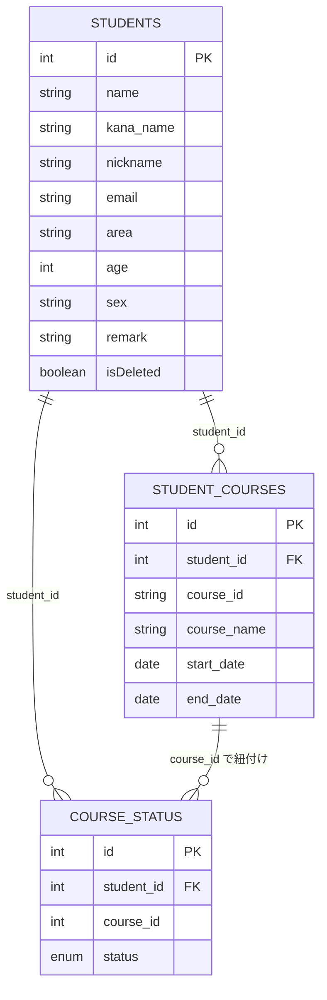

# Student Management System（受講生管理システム）  
<br>

## サービス概要

---

本アプリケーションは、**IT技術を教えるスクールにおける受講生の情報を管理するためのシステム**です。  
受講生の基本情報、コース情報、申込状況を統合的に管理し、REST API経由で操作できます。  
受講生に関する情報の検索・登録・編集・削除を行い、学習進捗や受講コースを容易に把握することが可能です。  
**Spring Boot + MyBatis + MySQL** を使用し、MVCアーキテクチャの理解と実践を目的に開発しました。


## 作成背景

---

Javaを学習する過程で、**Spring Boot・MyBatis・REST API構成**の全体像を理解しながら、  
業務レベルの実装を習得することを目的に作成しました。

単なる動作確認に留まらず、以下のような観点で構成を意識しました。

- **Controller → Service → Repository → DB** の流れを明確に理解する  
- **MyBatis + XML Mapper** による SQL 制御を実務に近い形で体験する  
- **単体テスト（JUnit / Mockito）** により品質を高める  
- **AWS EC2** を用いたクラウド環境でのデプロイ体験  
- **Swagger UI** による API ドキュメント自動生成  

これらを通じて、以下の2点を重視しました:
- **開発者視点**: コードの可読性・保守性を高める（Converter分離、テスト充実など）
- **利用者視点**: API仕様書の自動生成、分かりやすいエラーメッセージなど


## 主な使用技術

---

| 分類      | 技術                                           |
|---------|----------------------------------------------|
| 言語      | Java 21                                      |
| フレームワーク | Spring Boot 3.5.3                            |
| DB      | MySQL（本番環境） / H2 Database（テスト用）              |
| O/Rマッパー | MyBatis 3.0.4                                |
| API仕様書  | Springdoc OpenAPI (Swagger UI)               |
| テスト     | JUnit 5 / AssertJ / Mockito                  |
| ビルド管理   | Gradle                                       |
| コード自動生成 | Lombok（Getter/Setter、コンストラクタ自動生成など）          |
| バリデーション | Jakarta Validation（`@NotBlank`, `@Email` など） |


## 機能一覧

---

| 機能分類 | 内容                                                            | 対応メソッド |
|-----|---------------------------------------------------------------|---------------|
| 登録　 | 受講生の情報 + コース情報 + 申込状況を一括で新規に登録                                | `POST /registerStudent` |
| 一覧検索　 | 受講生詳細を全件検索（条件なし）                                              | `GET /studentList` |
| 単一検索　 | IDを指定し、受講生詳細を単一検索                                             | `GET /student/{id}` |
| 条件検索　 | 氏名・地域・年齢・性別・コース名などを任意に複数指定して受講生詳細を検索                          | `POST /studentList/criteria` |
| 更新　 | IDを指定し、受講生の情報 + コース情報 + 申込状況を更新　<br/>※削除は論理削除（isDeleted）として実装 | `PUT /updateStudent` |

※ 言葉の定義は以下のとおり

- 受講生： 氏名、居住地域、年齢、性別などをもつオブジェクト  
- コース： 受講のコース名、開始日、終了日などをもつオブジェクト  
- 申込状況： 「仮申込」「本申込」といった申込状況などをもつオブジェクト  
- 受講生詳細： 受講生、コース（申込状況含む）をもつオブジェクト  


### 📌 条件検索で指定可能な項目
- 受講生情報: `id`, `name`, `kanaName`, `nickname`, `area`, `ageMin`～`ageMax`, `sex`
- コース関連: `courseName`（部分一致）
- 申込状況: `status`（完全一致）
- 削除フラグ: `isDeleted`

　**すべての項目が任意**で、組み合わせ自由です。


## 実行結果（Postman）
### 【登録（Create）】
✅ 正常ケース  
・受講生情報、受講コースを２つ、各コースの申込状況を登録  
https://github.com/user-attachments/assets/6ab52a7e-e56d-4608-bb78-c3921211046b

⚠️ エラーパターン  
・入力ミス例①：申込状況（status）が指定外入力   
https://github.com/user-attachments/assets/aff76ad4-8100-4a3b-85d5-459d58623b74

・入力ミス例②：コース情報と申込状況の courseId が一致しない  
https://github.com/user-attachments/assets/f961850b-68c1-4126-b83a-23d90ca00836

### 【一覧検索（Read All）】
✅ 正常ケース  
・全件取得  
https://github.com/user-attachments/assets/3acd6300-eb15-4e93-bcb6-d3dca95a5b3d

### 【単一検索（Read by ID）】
✅ 正常ケース  
・登録済の受講生（例：ID=9）を取得  
https://github.com/user-attachments/assets/a8edb105-f338-460e-acfe-5cf8c2c2f400

⚠️ エラーパターン  
・存在しない受講生IDを指定 → 「受講生が見つかりません」エラー  
https://github.com/user-attachments/assets/dcf436f5-8f07-4d4d-bf9e-e2f400a9bba9

・入力ミス → 「IDは半角数字で入力してください」エラー  
https://github.com/user-attachments/assets/abe8963c-7f1f-48fe-bd9e-184a1d99bb6e

### 【条件検索（Read with Criteria）】
✅ 正常ケース（条件別の検索例）
・条件例①：年齢「30歳以上40歳以下」かつ 性別「男性」  
https://github.com/user-attachments/assets/4768a48c-0643-4be2-83e6-844bcfa86094

・条件例②：コース名に「Java」を含む  
https://github.com/user-attachments/assets/faddf72f-f8a4-4886-9640-cbe756ee3079

⚠️ エラーパターン  
・入力ミス例：年齢が範囲外／性別が「男性・女性・その他」以外／申込状況が「仮申込・本申込・受講中・受講終了」以外  
https://github.com/user-attachments/assets/ffff4207-0423-4ed6-9158-68b8c6f4ca4e

・想定外の例外発生時例：最小年齢が数字以外の「aaa」 → 「システムエラーが発生しました」と返却。
https://github.com/user-attachments/assets/b83e3c2a-c726-4fe4-828f-4172691e0958

### 【更新（Update）】
✅ 正常ケース  
・ID=9 の受講生について、居住地域：「滋賀県」→「大阪府」、申込状況：「受講中」→「受講終了」に変更  
https://github.com/user-attachments/assets/c77e776c-75ea-471c-93ae-e915fa190762


## API仕様書

---

**全エンドポイントの詳細仕様は、自動生成された下記のAPI仕様書（Swagger UI）で確認できます。**  
[API仕様書（GitHub Pages）](https://tomo-taka108.github.io/StudentManagement/)


## 主なクラスの役割

---

| クラス                          | 役割概要                                                                  |
| ---------------------------- |-----------------------------------------------------------------------|
| **StudentController**        | REST APIのエンドポイントを定義し、HTTPリクエスト（GET/POST/PUT）を通じてService層を呼び出す。        |
| **StudentService**           | 業務ロジックを実装する層。Repositoryから取得したデータを統合し、StudentDetailを生成してControllerに返す。 |
| **StudentRepository**        | MyBatisのMapperインターフェースとして、Mapper XMLに定義されたSQLを実行し、DBアクセスを担当する。        |
| **StudentConverter**         | 受講生・コース・申込状況の情報を結合し、StudentDetailオブジェクトを生成する変換クラス。                    |
| **StudentDetail**            | 受講生・コース・申込状況を統合して保持する受講生詳細のデータモデル。                                    |
| **GlobalExceptionHandler**   | バリデーションエラーや404・500系例外を一元的に処理する例外ハンドラクラス。                              |
| **StudentNotFoundException** | 指定したIDに該当する受講生が存在しない場合にスローされる独自例外クラス。                                 |


## MyBatisマッピング概要

---

| メソッド                       | SQL概要               |
| -------------------------- |---------------------|
| `search()`                 | 受講生の全件検索            |
| `searchStudent(String id)` | ID指定による受講生の検索       |
| `searchWithCriteria()`     | 検索条件を指定して受講生の検索     |
| `registerStudent()`        | 受講生の新規登録（IDは自動採番）   |
| `registerStudentCourse()`  | コース情報の新規登録（IDは自動採番） |
| `registerCourseStatus()`   | 申込状況の新規登録（IDは自動採番）  |
| `updateStudent()`          | 受講生の更新              |
| `updateStudentCourse()`    | コース情報の更新            |
| `updateCourseStatus()`     | 申込状況の更新             |


## テスト構成

---

| 層           | テストクラス                  | 使用技術                  | 検証内容                           |
| ----------- | ----------------------- |-----------------------|--------------------------------|
| Repository層 | `StudentRepositoryTest` | MyBatis + H2 Database | Mapper XML と SQLマッピングの正確性を検証   |
| Service層    | `StudentServiceTest`    | Mockito + JUnit       | 業務ロジックの分岐・例外処理を検証              |
| Controller層 | `StudentControllerTest` | Spring MockMvc        | REST APIエンドポイントのリクエスト／レスポンスを検証 |
| Converter層  | `StudentConverterTest`  | JUnit                 | 各エンティティのデータ変換結果の整合性を検証         |


## ER図

---


### 📌 テーブル設計のポイント
- `student_id` は `STUDENTS` テーブルへの外部キー（1人が複数コース可）
- `course_id` は文字列型で、`STUDENT_COURSES` と `COURSE_STATUS` で紐付け
- `COURSE_STATUS.id` は自動採番だが、実際の紐付けは `(student_id, course_id)` の組み合わせで行う


## 工夫した点・苦労した点

---

### 1. 受講生1人が複数コースを持つ複雑なデータ構造の設計
受講生（`students`）、コース情報（`student_courses`）、申込状況（`course_status`）の
**3テーブルを跨いだ整合性を保つ設計**に苦労しました。

**特に工夫した点:**
- **登録時のバリデーション強化**
```java
  // StudentService.java registerStudent() メソッド（L116-130付近）
  // ① courseIdの重複チェック
  // ② studentCourseListとcourseStatusListのcourseId一致確認
```
これにより、「コース情報はあるのに申込状況がない」といった  
データ不整合を**登録時点で防止**しています。

- **Converterクラスによるデータ結合の分離**  
  `StudentConverter`で「受講生に紐づくコース」「コースに紐づく申込状況」を  
  フィルタリング・結合する処理を**Service層から分離**。  
  これにより、Service層のテストが書きやすくなりました。


### 2. 任意条件による複合検索機能の実装
`StudentSearchCriteria` クラスを設計し、  
氏名・フリガナ・年齢・性別・コース名・申込状況などを**任意に組み合わせて検索**できるようにしました。  
MyBatis XMLでは `<if>` や `<where>` を駆使して動的SQLを実装し、  
Service層ではさらにコース名・ステータスのフィルタリングを行っています。  
これにより、実務的な検索要件に近い柔軟な条件検索を実現しました。


### 3. 論理削除（`isDeleted`）の実装
物理削除ではなく**論理削除**を採用しました。  
当初は削除用のDELETEエンドポイントを作ることを考えましたが、  
実務では「削除したデータも履歴として残す」ケースが多いと学び、  
**UPDATEで`isDeleted=true`にする方式**に変更しました。


### 4. テストデータ（data.sql）の工夫
- 受講生5人に対し、コース数を意図的にバラつかせた（1人1～2コース）
- 申込状況も「仮申込」「本申込」「受講中」「受講終了」をすべて含む

これにより、**「コース0件の受講生」や「ステータス混在」などの  
境界値テストがしやすい**データ構成になっています。


### 5. Swagger UIの例示（`example`）の充実
全エンティティクラスで`@Schema(example = "...")`を設定し、  
Swagger UIから**そのままテスト実行できる**ようにしました。  
特に`StudentSearchCriteria`では、バリデーションルールが分かるよう  
不正な値の例もコメントで記載しています。


## 今後の展望

---

### ♦ 短期的な対応（設計、コードの改善）◆

### 1. コース情報の正規化（コースマスタの活用）
現在、`student_courses`テーブルに`course_name`を持たせていますが、  
既に`Course.java`（コースマスタ）が存在しているので、  
**`course_id`だけを外部キーにして`courses`テーブルから名前を取得する**  
設計に変更したいです。

**メリット:**
- コース名の変更が一箇所で済む
- データの重複が減る

### 2. 日付範囲での検索条件追加 
`startDate`（受講開始日）や`endDate`（受講終了予定日）での範囲検索も  
実務では必要になると考えています。

**例:** 「2025年4月1日～6月30日に開始したコース」を検索

### 3. 受講履歴の時系列表示
現在は「どのコースを受講中か」は分かりますが、  
**過去の受講履歴を時系列で表示する機能**があると、  
受講生の受講履歴が可視化できて「教育管理システム」として有効だと考えています。 
 

### ♦ 中長期的な対応 ♦
- フロントエンドでの管理画面作成  
- Docker化によるローカル開発環境の自動構築  
　→ チーム開発を想定し、環境差異を吸収できる構成を目指す。
- Spring Security を使ったログイン認証機能の追加  
　→ 管理者／講師など、ユーザー権限ごとのアクセス制御が望ましい。

今回の開発を通して、Spring Bootの基礎を一通り体験できましたので、  
これからは「運用を意識した開発」に一歩ずつ近づいていきたいと思います。


