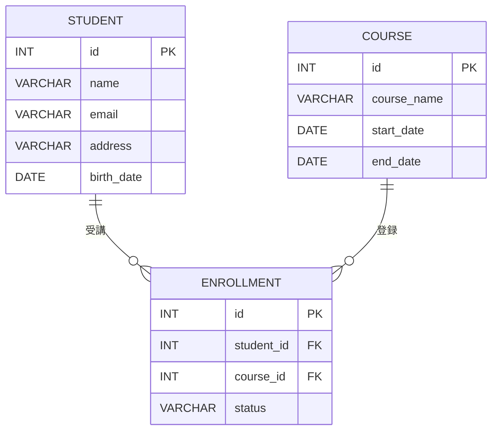

# Student Management System（受講生管理システム）

## プロジェクト概要
本アプリケーションは、**プログラミングスクールにおける受講生情報を管理するためのシステム**です。  
受講生の登録・編集・削除・検索を行い、学習進捗や受講コースの把握を容易にします。  
**Spring Boot + MyBatis + Thymeleaf** を使用し、MVCアーキテクチャの理解と実践を目的に開発しました。

---

## 作成背景
スクールの最終課題として、以下のスキルを習得・実践することを目的に作成しました。

- Spring Bootを用いたWebアプリ開発の流れを理解  
- MyBatisによるデータベース操作の実践  
- Thymeleafを使った画面描画の仕組みを学習  
- AWS EC2を用いたクラウド環境でのデプロイ体験  

---

## 使用技術（Tech Stack）

| 分類 | 技術 |
|------|------|
| 言語 | Java 17 |
| フレームワーク | Spring Boot 3.x / MyBatis |
| テンプレートエンジン | Thymeleaf |
| データベース | MySQL 8.x |
| ビルドツール | Maven |
| ORM補助 | MyBatis Mapper XML |
| バリデーション | Jakarta Validation（`@Valid`, `BindingResult`） |
| フロント | HTML / CSS (Thymeleaf) |
| IDE | IntelliJ IDEA |
| デプロイ先 | AWS EC2（Amazon Linux） |

---

## システム構成図

---

## ER図

---

## 主な機能（CRUD）

| 機能 | 説明 |
|------|------|
| 一覧表示 | 登録済みの受講生情報をテーブル形式で表示 |
| 新規登録 | 名前・住所・メールなどを登録 |
| 編集 | 既存の受講生情報を更新 |
| 削除 | 論理削除によりフラグ管理 |
| 検索 | 氏名・居住地・申込状況など複合条件で絞り込み |
| 入力チェック | Validation + BindingResultを利用した入力検証 |

