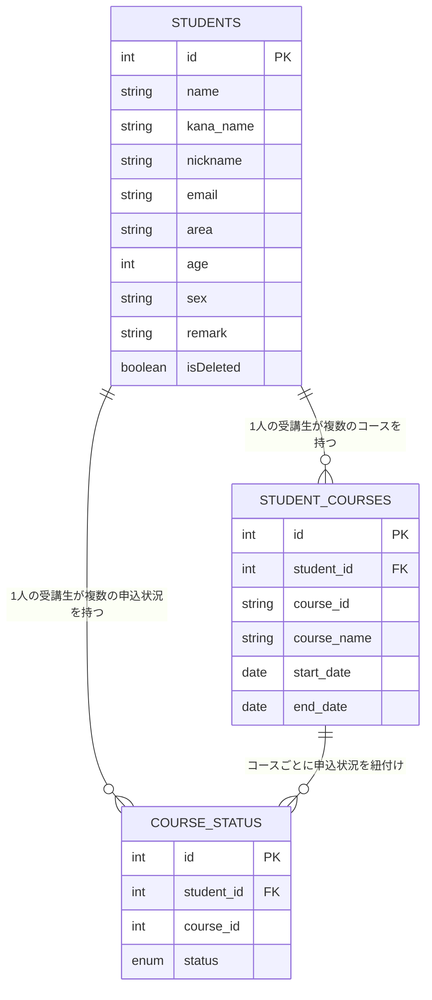

# Student Management System（受講生管理システム）  
 

## サービス概要

---

本アプリケーションは、**プログラミングスクールにおける受講生の情報を管理するためのシステム**です。  
受講生の基本情報、コース情報、申込状況を統合的に管理し、REST API経由で操作できます。  
受講生に関する情報の検索・登録・編集・削除を行い、学習進捗や受講コースを容易に把握することが可能です。  
**Spring Boot + MyBatis + MySQL** を使用し、MVCアーキテクチャの理解と実践を目的に開発しました。

## 作成背景

---

Javaを学習する過程で、**Spring Boot・MyBatis・REST API構成**の全体像を理解しながら、  
業務レベルの実装を習得することを目的に作成しました。

単なる動作確認に留まらず、以下のような観点で構成を意識しました。

- **Controller → Service → Repository → DB** の流れを明確に理解する  
- **MyBatis + XML Mapper** による SQL 制御を実務に近い形で体験する  
- **単体テスト（JUnit / Mockito）** による品質保証を組み込む  
- **AWS EC2** を用いたクラウド環境でのデプロイ体験  
- **Swagger UI** による API ドキュメント自動生成  

これらを通じて、**開発者・利用者の双方にとって理解しやすい設計**を心がけています。

## 主な使用技術

---

| 分類 | 技術 |
|------|------|
| 言語         | Java 21                                      |
| フレームワーク    | Spring Boot 3.5.3                         |
| DB         | MySQL（本番） / H2 Database（テスト）             |
| O/Rマッパー    | MyBatis 3.0.4                                |
| API仕様書     | Springdoc OpenAPI (Swagger UI)               |
| テスト        | JUnit 5 / AssertJ / Mockito                  |
| ビルド管理      | Gradle                                       |
| Lombok     | Getter/Setter・コンストラクタ自動生成                    |
| バリデーション    | Jakarta Validation（`@NotBlank`, `@Email` など） |

## 機能一覧

---

| 機能分類   | 内容 | 対応メソッド |
|-----------|------|---------------|
| 受講生詳細の一覧表示　 | 受講生詳細の全件検索（条件なし） | `GET /studentList` |
| 受講生詳細の特定表示　 | 受講生ID指定による受講生詳細の単一検索 | `GET /student/{id}` |
| 条件検索　 | 氏名・地域・年齢・性別・コース名などを任意に複数指定して受講生詳細を検索 | `POST /studentList/criteria` |
| 新規登録　 | 受講生 + コース情報 + 申込状況を一括で新規に登録 | `POST /registerStudent` |
| 更新処理　 | 受講生 + コース情報 + 申込状況を更新・論理削除（isDeleted） | `PUT /updateStudent` |

※ 言葉の定義は以下のとおり

- 受講生： 氏名、居住地域、年齢、性別などをもつオブジェクト  
- コース： 受講のコース名、開始日、終了日などをもつオブジェクト  
- 申込状況： 「仮申込」「本申込」といった申込状況などをもつオブジェクト  
- 受講生詳細： 受講生、コース（申込状況含む）をもつオブジェクト  

## 実行結果（Postman）

---

## 主なAPIエンドポイント

---

| HTTPメソッド | パス                      | 機能概要              | 戻り値                 |
| -------- | ----------------------- | ----------------- | ------------------- |
| `GET`    | `/studentList`          | 受講生詳細の全件取得        | List<StudentDetail> |
| `GET`    | `/student/{id}`         | ID指定で受講生詳細を取得     | StudentDetail       |
| `POST`   | `/studentList/criteria` | 検索条件指定で受講生一覧取得    | List<StudentDetail> |
| `POST`   | `/registerStudent`      | 新規受講生登録           | StudentDetail       |
| `PUT`    | `/updateStudent`        | 受講生情報・コース・申込状況の更新 | String（成功メッセージ）     |

## API仕様書

---

[API仕様書（GitHub Pages 公開）](https://tomo-taka108.github.io/StudentManagement/)

## MyBatisマッピング概要

---

| メソッド                       | SQL概要               |
| -------------------------- |---------------------|
| `search()`                 | 受講生の全件検索            |
| `searchStudent(String id)` | ID指定による受講生の検索       |
| `searchWithCriteria()`     | 検索条件を指定して受講生の検索     |
| `registerStudent()`        | 受講生の新規登録（IDは自動採番）   |
| `registerStudentCourse()`  | コース情報の新規登録（IDは自動採番） |
| `registerCourseStatus()`   | 申込状況の新規登録（IDは自動採番）  |
| `updateStudent()`          | 受講生の更新              |
| `updateStudentCourse()`    | コース情報の更新            |
| `updateCourseStatus()`     | 申込状況の更新             |

## 主なクラスの役割

---

| クラス                          | 役割概要                                              |
| ---------------------------- |---------------------------------------------------|
| **StudentController**        | REST APIエンドポイント定義。GET/POST/PUTを通じてService層を呼び出す。  |
| **StudentService**           | 業務ロジック層。Repositoryから取得したデータを統合し、StudentDetailを生成。 |
| **StudentRepository**        | MyBatisのMapperインターフェース。DBアクセスを担当。                 |
| **StudentConverter**         | 受講生・コース・申込状況を結合して受講生詳細（StudentDetail）に変換。         |
| **StudentDetail**            | 受講生・コース・申込状況を表すデータモデル。                            |
| **GlobalExceptionHandler**   | バリデーション違反・404エラー・サーバーエラーなどを共通処理。                  |
| **StudentNotFoundException** | IDに該当する受講生が存在しない場合の独自例外。                          |

## テスト構成

---

| 層           | テストクラス                  | 使用技術         | 検証内容       |
| ----------- | ----------------------- | ------------ |------------|
| Repository層 | `StudentRepositoryTest` | MyBatis + H2 | SQLマッピング検証 |
| Service層    | `StudentServiceTest`    | Mockito      | 業務ロジック検証   |
| Controller層 | `StudentControllerTest` | MockMvc      | エンドポイント検証  |
| Converter層  | `StudentConverterTest`  | JUnit        | データ変換整合性確認 |

## ER図

---

## 工夫した点・苦労した点

---

### 1. 三層アーキテクチャを「完全な分離構造」で実装
Controller・Service・Repositoryの各責務を厳格に分離し、  
- **Controller**：リクエスト受付とレスポンス生成のみ  
- **Service**：業務ロジックの集約  
- **Repository**：MyBatisを通じたSQL実行  
という構成を一貫。  
結果として、**各層の役割を意識したテスト設計（MockMvc / Mockito）**が可能になりました。

  
### 2. MyBatisのXML Mapperを実務レベルで活用
`studentRepository.xml` にて `<if>`・`<where>`・`<choose>` などの  
**動的SQL構築**を活用。  
条件検索では「nullまたは空文字を除外するロジック」を柔軟に設計し、  
**「複数条件を組み合わせた検索API」**を実現しました。

### 3. JUnit・Mockitoによる段階的テスト設計
単なる動作確認ではなく、  
- Repository層 … SQLとマッピング検証（H2 DB使用）  
- Service層 … Mock化でロジックの呼び出し確認  
- Controller層 … MockMvcによるHTTPテスト  
という **3層単体テストを全て網羅**。  
データの整合性を担保するテストケースを多数実装し、  
**「安全に改修できるコード構造」**を体験的に理解しました。

### 4. Bean Validation と ExceptionHandler の統合
`@Valid` と `BindingResult` を使用して  
入力チェックを自動化し、`GlobalExceptionHandler` にて  
**バリデーション・404・500系エラーを一元処理**。  
REST APIとしての信頼性と可読性を高めました。

### 5. ドメインモデルの正規化と再利用性の向上
受講生詳細（`StudentDetail`）を中心に、  
`Student` / `StudentCourse` / `CourseStatus` を統合。  
変換は `StudentConverter` に切り出すことで、  
**ビジネスロジックからデータ結合処理を分離**し、  
後続のフロントエンド統合にも耐えられる設計としました。

### 6. AWSデプロイへの対応（学習用）
EC2上でのデプロイ実験を行い、  
`application.properties` の `server.address=0.0.0.0` 設定や  
MySQL接続設定（RDS互換）を含め、  
**クラウド環境でのSpring Boot運用の基礎**を実践しました。

## 今後の発展予定

---
 
- ThymeleafによるWeb画面（一覧・登録・更新フォーム）の追加  
- Dockerfile・docker-composeによる環境自動構築  
- AWS RDS連携とGitHub ActionsによるCI/CD化  
- ログイン認証（Spring Security）の導入

